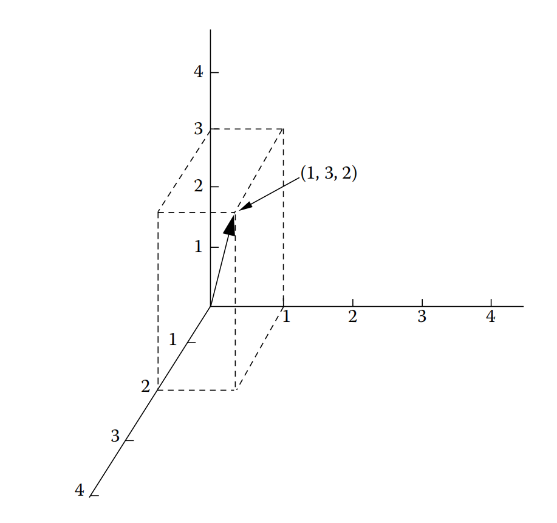

# 初等代数基础

## 标量代数

标量代数指的是运用在实数集上的普通代数。大部分内容我们在小学或初中就学过。使用**标量代数**这个名字主要是跟**线性代数**区分开。

### 标量代数基本定律

1. 加法封闭律：$a+b$ 得到一个唯一的实数
2. 加法交换律：$a+b = b+a$
3. 加法结合律：$(a+b)+c = a+(b+c)$
4. 乘法封闭律：$ab$ 得到一个唯一的实数
5. 乘法交换律：$ab = ba$
6. 乘法结合律：$(ab)c = a(bc)$
7. 加法同一律：存在数0使得 $a+0=0+a=a$（0被称为加法运算的单位元）
8. 加法反转律：$a+(-a) = (-a)+a = 0$（$-a$被称为$a$的逆元）
9. 乘法同一律：存在数1使得 $a1=1a=a$，（1被称为乘法运算的单位元}
10. 乘法反转律：$a(\frac 1 a) = (\frac 1 a)a = 1$（$\frac 1 a$被称为$a$的逆元）
11. 分配律：$a(b+c) = ab+ac$

> **延申**
> 
> 满足封闭性、结合律、有单位元、有逆元的二元运算构成**群**代数结构（详见[向量](#vector)）。

上面的定律满足实数集上的运算。但0具有某些特性，需要单独说明。
$$
\frac 0 a = 0
$$

$\frac a 0$ 未定义（没有意义）

$\frac 0 0$ 不确定

### 符号规则

1. 乘法符号规则：$\begin{aligned}a(-b) &= -(ab)\\(-a)(-b) &= +(ab)\end{aligned}$
2. 除法符号规则：$\begin{aligned}\frac {-a} b &= \frac a {-b}\\ \frac {-a}{-b} &= \frac a b\end{aligned}$
3. 移除括号法则：$\begin{aligned}-(a-b) &= -a+b\\-(a+b) &= -a-b\end{aligned}$

### 指数规则

如果 $n$ 是正整数，则 $x^n$ 表示：
$$
\underbrace{xx \dots x}_n
$$
如果$x^n = a$，则 $x$ 是 $a$ 的 $n$ 次方根。指数运算遵循如下规则：

1. $x^ax^b = x^{a+b}$
2. $(x^a)^b = x^{ab}$
3. $(xy)^a = x^ay^a$
4. $\big(\frac x y\big)^a = \frac {x^a} {y^a}$
5. $\frac {x^a} {x^b} = x^{a-b}$

### 解简单方程

设 $x$ 是未知数，$a,b,c,d$ 是已知数，给定下面方程：

$$
ax+b = cx+d
$$

求解未知数 $x$ 可以通过方程等号两边同时进行运算直到方程的一边只剩下未知数 $x$，方程另一边都是已知数。比如

$ax-cx+b= d$（方程两边同时减 $cx$）

$ax-cx= d-b$（方程两边同时减 $b$）

$(a-c)x= d-b$（逆向使用分配律）

$x = \frac {d-b} {a-c}$（方程两边同除以 $a-c$）

## 
向量

近世代数的主要目的之一是根据系统的抽象规则来分类数学系统，比如标量代数就是一个代数系统。最简单的代数系统就是群。群由一个元素集合和集合上的二元运算组成。群的定义如下：

若集合 $G \ne \empty$，定义 $G$ 上的二元运算 $\cdot: G \times G \mapsto G$ 构成的代数结构 $(G, \cdot)$，满足：

1. 封闭性：即 $G$ 的任意两个元素在 $\cdot$ 下的运算结果都是该集合的一个元素。（$\forall a,b \in G，a \cdot b \in G$ ）
2. 结合律：$\forall a,b,c \in G, (a \cdot b) \cdot c = a \cdot (b \cdot c)$
3. 单位元：$G$中存在元素$e$，使$G$中任意元素$a$与之运算的结果都等于$a$本身。（$\forall a \in G, \exist e \in G, a \cdot e = e \cdot a = a$）
4. 逆元：$G$中存在元素$b$，使$G$中任意元素$a$与之运算的结果都等于单位元。（$\forall a \in G, \exist b \in G, a \cdot b = b \cdot a = e$）

则 $(G, \cdot)$ 称为一个群，简写为 $G$。

显然群与前面的标量系统非常相似。原本在标量系统中需要11个定律在群中可以简化为4个。

在各种抽象数学系统中，被称为向量空间的系统在因子分析中非常重要。注意，我们不要被空间这个词影响我们对向量空间的理解。向量空间可以不具备几何含义，完全作为一个抽象的系统来处理。向量的几何表示只是向量空间的特例。一个向量空间由两组数学对象构成--向量集合 $V$ 和 域（例如标量代数中的标量）元素集合 $R$--然后通过两个运算将二者结合在一起。第一个运算是向量加法，第二个运算是标量乘法。

### 向量加法

$\forall u,v,w \in V$，标量加法有如下性质：

1. $u + v$ 依然是 $V$ 中唯一定义的向量
2. $u + (v + w) = (u + v) + w$
3. $u+v = v+u$
4. $\exists 0 \in V, u+0 = 0+u = u$
5. $\exists -u \in V, u+(-u) = (-u)+u = 0$

可以很容易发现，向量加法满足群的要求。

### 标量乘法

$\forall a, b\in \Reals, \forall u,v \in V$，标量乘法有如下性质：

1. $au \in V$
2. $a(u+v) = au+av$
3. $(a+b)u = au+bu$
4. $a(bu) = ab(u)$
5. $1u = u$
6. $0u = 0$

目前为止，在引入向量空间概念时，我们将其视为一种抽象数学系统，可以避免去考虑向量具体可能是什么。我们这样做的目的是为了让读者从一开始就意识到，向量空间是一个抽象的系统，可以与各种数学对象有关。例如，向量空间的向量可以是任意领域中的元素，例如实数集。在这种情况下，向量的加法对应于域中元素的加法。在另一个例子中，向量空间的向量可以是n个元组，而n个元组是实数的有序集。（在接下来的讨论中，我们将结合n元组表示的向量来更充分发展向量的性质。）向量还可以是数理统计中的一维随机变量。这对多元统计、特别是因子分析和结构方程建模具有重要意义，因为它意味着可以使用向量概念来统一有限和无限集中变量的处理。

### n元组向量

在n元组向量空间中，我们用向量表示n维空间中的点，这个点由一组有序数指定，这组有序数被称为n元组，也就是这个点的坐标。例如，（1,3,2）是一个表示三维空间中向量的3元组，其中沿x轴方向距原点（坐标系）1个单位，沿y轴方向距原点3个单位，沿z轴方向距原点2个单位。在图像上，我们通常使用从坐标系的原点到点绘制一个箭头来描绘一个向量。见图2.1。

图2.1 用图像表示三维空间中向量(1, 3, 2)

### 向量相等

如果两个向量具有相同的坐标，则两个向量相等。

例如，如果 $\bm{a}=(1,2,4)$，$\bm{b}=(1,2,4)$，那么 $\bm{a} = \bm{b}$。两个向量相等的必要条件是它们具有相同数量相同数值的坐标。例如 $\bm{a}=(1,2,3,4)$，$\bm{b}=(1,2,3)$，此时$\bm{a} \ne \bm{b}$。实际上，当两个向量坐标数不同时，它们表示不同阶的n元组，不同阶的n元组不能进行比较或相加。

### 标量和向量