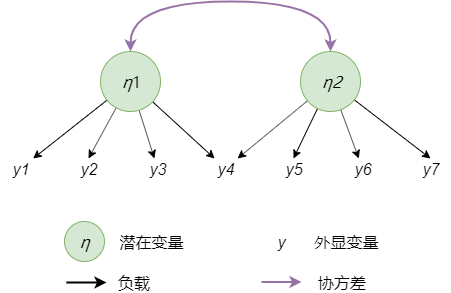
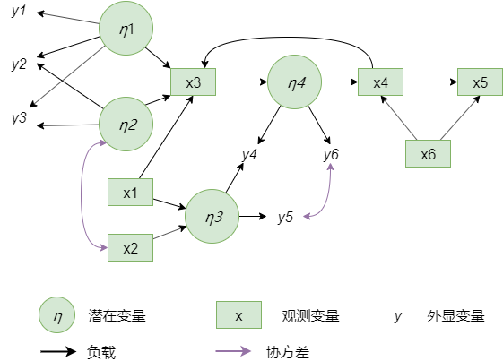

# 结构方程模型

## 简介

结构方程模型（SEM）不是新兴领域，它的历史可以追溯到遗传学家Sewall Green Wright的路径分析（PA）技术（Wright, 1921）。PA可用方程(1)描述：
$$
\tag{1}\mathit{x = Bx + \epsilon}
$$
其中 $x$ 是一个 $n_x \times 1$ 观测变量向量，$\epsilon$ 是随机误差向量，$B$ 是参数化矩阵。注意，方程(1)可以通过推断 $x$ 来重新表述为线性回归模型的一种特殊情况：
$$
\mathit{x = \underbrace{(I_{n_x} - B)^{-1}}_{C} \epsilon = C\epsilon = \hat{\epsilon}}
$$
如果我们进一步假设 $\mathit{\epsilon \backsim N(0, \Psi) }$，其中 $\Psi$ 是 $n_x \times n_x$ 协方差矩阵，那么 $\mathit{x \backsim N(0, C_\mu, C \Psi C^T)}$。为了简洁起见，我们还假设数据是中心化的。通常，$\Psi$ 和 $B/C$ 是未知的，需要通过极大似然法进行估计，但在Wright的时代，这种计算技术是不可行的，而且在他的原始著作(Wright, 1934)中也没有被考虑到，并且 $\Psi$ 上往往还蕴含某种结构。在PA体系里，$\Psi$ 很自然地被假设为是对角矩阵。图1展示了PA模型的一个例子。

有些现象无法观察到，或者至少在收集数据时没有被发现，但研究人员依然试图通过引入潜在变量将其影响纳入模型。研究人员在设计模型时，首要任务是确认是否存在潜在变量。最常见的方法是拟合一个带有潜在变量的线性模型，如方程(2)。
$$
\tag{2}\mathit{y = \Lambda\eta + \delta}
$$
其中 $y$ 是 $n_y \times 1$ 观测变量或指示变量向量，$\delta$ 是随机误差向量，$\eta$ 是 $n_\eta \times 1$ 潜在变量向量，$\Lambda$ 是指示变量负载因子的参数化矩阵。通常情况下，我们假设 $\lambda \backsim (0, \Theta)，\eta \backsim (0, \Psi) $，其中 $\Theta$ 通常是严格的对角矩阵，但非对角协方差矩阵也可以。这种方法被称为验证性因子分子（CFA），由 J¨oreskog 于1967年引入（ J¨oreskog (1967)）。图1展示了CFA模型的一个例子。

图1 CFA模型

请注意，尽管指示变量和观测变量在效果上是等价的，但由于历史原因，我们在公式和图形用不同的符号表示他们。

然而，从方程2得到的模型是不可识别的。这是因为我们可以想象任意维度的潜在变量都能很好地与数据拟合。事实上，我们可以写出
$$
\mathit{y = \Lambda\eta + \delta = \Lambda \frac{1}{\alpha} \alpha \eta + \delta = (\frac{1}{\alpha} \Lambda) \alpha \eta + \delta = \hat{\Lambda}\hat{\eta} + \delta} 
$$
其中 $\alpha$ 是任意标量。这个问题可以通过将一些负载系数或方差参数固定为某个值来解决；通常的做法是将每个潜在变量的第一个负载系数固定为1.0（例如图1中，$y_1$和$\eta_1$, $y_4$和$\eta_2$之间的负载系数是固定的）。

然而，CFA模型不允许观测变量或潜在变量之间存在偶然相互作用。另一方面，结构方程模型可以模拟变量之间的任意交互作用。虽然对结构方程模型没有严格的定义，但它是一个相当广泛的术语。这里我们假设我们所说的“SEM模型”指的是PA和CFA的混合，根据SEM = PA + CFA的思想，我们得到方程(3)：
$$
\tag{3}\begin{cases}
   \begin{bmatrix}\eta \\x\end{bmatrix} & = \omega = B\omega+\epsilon, &\epsilon \backsim N(0, \Psi)  \\
   \begin{bmatrix}y \\x\end{bmatrix} & = z = \Lambda\omega + \delta, &\delta \backsim N(0, \Theta) 
\end{cases}
$$
其中 $\eta, x, y$ 与方程1和方程2中指的是同一个向量，$\omega$ 是潜在变量 $\eta$ 和 观测变量 $x$ 的 $n_\omega \times 1$ （$n_\omega = n_\eta + n_x$）向量。 $z$ 是所有观测变量 $x$ (包括指示变量 $y$) 的 $n_z \times 1$ （$n_z = n_x + n_y$）向量。$\epsilon$ 和 $\delta$ 是对应 $n_\omega \times 1$ 和 $n_z \times 1$ 的随机向量。向量 $x$ 分割为 $x^{(1)}$ 和 $x^{(2)}$ 两个子向量，其中 $x^{(1)}$ 是 $x_i$ 的内生向量，$x^{(2)}$ 是 $x_i$ 的外生向量。$\Psi$ 中 $x^{(2)}$ 之间的协方差固定为他们的样本值。

我们可以通过方程(3)推断出 $n_z \times n_z$ 维协方差矩阵 $\Sigma$  ：
$$
\tag{4}\Sigma = \mathbb{E}[zz^T] = \mathit{\Lambda C \Psi C^T \Lambda^T + \Theta}
$$

然后用最大似然法(ML)或加权最小二乘法(WLS)拟合到一个样本协方差矩阵 $S$ (Hoyle, 2015)。

## 常规模型

该模型最接近经典SEM并且几乎与公式3中的模型相同。然而，有一些技术上的差异能够带来更好的性能和更广泛的模型定义。该模型模型为：
$$
\tag{5}\begin{cases}
   \begin{bmatrix}\eta \\x\end{bmatrix} & = \omega = B\omega+\epsilon, &\epsilon \backsim N(0, \Psi)  \\
   \begin{bmatrix}y \\x^{(1)}\end{bmatrix} & = z = \Lambda\omega + \delta, &\delta \backsim N(0, \Theta) 
\end{cases}
$$
这里最大的变化是 $y$ 不是外显变量的向量，而是输出观测变量的向量，即依赖于其他变量但不向其他变量指向任何箭头的变量。实际上，不像其他SEM软件，常规模型没有”外显“变量的概念。我们认为，分离观测变量存在的唯一原因是CFA的历史遗留。虽然不是很重要，但在文本输出中区分外险变量有三个缺点：

1. 在SEM研究人员之间造成混淆；
2. 一旦一个变量被指定为外显变量，就不可能由任何观测变量回归；
3. 没机会从大尺度 $C = (1-B)^{-1}$ 矩阵的x向量的结果中排除输出变量，并且它的逆很难求。

方程5的另一个变化是减小 $z$ 的大小，用 $x^{(1)}$ 代替 $x$。这种变化是很自然的，因为外生变量的协方差通常没有参数化，$\Sigma$ 中对应于外生变量的部分是静态的，我们对其不感兴趣。这将进一步提升性能，因为在一些目标函数中，$\Sigma$ 必须求逆。

图2 SEM模型

为了帮助读者理解矩阵是如何参数化的，请参考图2。

## 模型评估

我们可以用多个损失函数来最小化参数估计。这里和文中的其他部分，我们将经常假设参数化矩阵是由某个向量 $\theta$ 参数化的。严格地说，我们应该写做$\mathit{B(\theta), \Psi(\theta), \Sigma(\theta)}$等，但是为了简洁起见，我们经常省略将矩阵作为参数向量$\theta$的函数的显式声明。

最大似然法假设变量都服从正态分布：

### Wishart最大似然

$$
\tag{6}\mathit{F(\theta \mid S) = tr\{S\Sigma^{-1}(\theta)\}+ln | \Sigma(\theta) |}
$$

方程6是Wishart分布的极大似然法。Wishart极大似然法等价于多元正态极大似然法，推导如下：
$$
\mathit{\begin{align}
   l(\theta \mid Z) &= \sum_{i=1}^{n}(z_i - \mu)^T\Sigma^{-1}(z_i-\mu)+ln| \Sigma | \\
   &= tr\bigg\{\sum_{i=1}^{n}(z_i - \mu)^T\Sigma^{-1}(z_i-\mu)\bigg\}+nln| \Sigma | \\
   &= \sum_{i=1}^{n}tr\{(z_i - \mu)^T\Sigma^{-1}(z_i-\mu)\}+nln| \Sigma | \\
   &= tr\bigg\{\bigg(\sum_{i=1}^{n}(z_i - \mu)^T(z_i-\mu)\bigg)\Sigma^{-1}\bigg\}+nln| \Sigma |\\
   &= tr\big\{MM^T\Sigma^{-1}\big\}+nln| \Sigma | \\
   &= ntr\big\{S\Sigma^{-1}\big\}+nln| \Sigma | \propto tr\big\{S\Sigma^{-1}\big\}+ln| \Sigma |
\end{align}}
$$
其中$\mathit{M = [z_{(1)}, z_{(2)}, \dots, z_{(n)}] - \mu}$ 是中心数据矩阵，$\mathit{S = \frac 1 n MM^T}$ 是有偏的样本协方差矩阵，如果我们使用无偏的矩阵 $\mathit{S = \frac 1 {n-1}MM^T}$ 则：
$$
\tag{7}\mathit{F(\theta \mid S) = (n-1)tr\{S\Sigma^{-1}(\theta)\}+nln | \Sigma(\theta) |}
$$

### 全信息最大似然（FIML）

上述所有方法都是在计算 $S$ 的阶段自然地处理缺失数据。然而，全信息最大似然可能是一种更可行的方法。

FIML的核心与多元正态最大似然非常相似，但是对似然求和中的每个项，我们在$\Sigma$中剔除对应于缺失变量的列和行。当所有数据都存在时，FIML退化为多元正态，如公式7所示。

### 最小二乘

当不满足正态分布假设时，最小二乘方法可能更加可靠。

#### 无权最小二乘

$$
\tag{8}\mathit{F(\theta \mid S) = tr\{(\Sigma(\theta)-S)(\Sigma(\theta)-S)^T\} = tr\{(\Sigma(\theta)-S)^2\}}
$$

其中$S$是样本协方差矩阵。

#### 广义最小二乘

$$
\tag{9}\mathit{F(\theta \mid S) = tr\big\{(I_{n_z} - \Sigma(\theta)S^{-1})^2\big\}}
$$

就是最小马氏距离。

#### 加权最小二乘

$$
\tag{10}\mathit{F(\theta \mid S) = \bigg(vech\big(\Sigma(\theta)-vech(S)\big)\bigg)^TW^{-1}\bigg(vech\big(\Sigma(\theta)-vech(S)\big)\bigg)}
$$

其中 $vech$ 为半向量化因子，$W$是权重矩阵，通常选取为$\Sigma$的渐近协方差矩阵。

加权最小二乘通常应用在数据不满足正态分布时。如果$W$不可逆，可以使用最接近$W$的正定矩阵代替。

