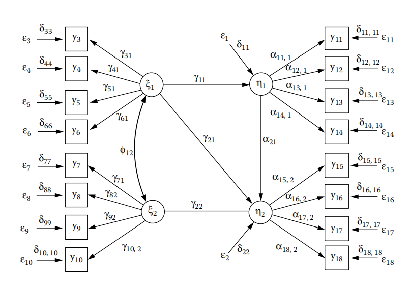

# 结构方程模型

## 结构方程模型基础
目前，大家可能只熟悉统计学的探索性使用，如描述性统计均值、回归和探索性因子分析，现在将向大家介绍一种使用统计模型的新方法。这个方法的重点是测试假设模型，其中对模型的参数施加了某些“过度识别”的约束。 其目的是测试具有这些约束条件的模型是否拟合给到的数据。在统计均值中，最接近的例子是对零假设的检验，即均值等于研究人员预先指定的一个特定值。探索是指简单地估计一个变量的匀值而不加任何约束，而不是使估计成为可能的最小约束。在回归中，我们估计回归系数而不对它们进行约束。在探索性因子分析中，我们估计因子载荷和因子相关性，只施加必要的最小约束来获得唯一值。假设检验包括预先指定的某些参数，并对这些值进行测试。现在，我们不会只讨论假设检验，但假设检验非常重要，当我们开始思考结构方程模型时大家需要将其牢记心中。

在大多数情况下，除了假设的参数约束值外，在结构方程模型中还可能存在估计的参数，因为研究人员不知道要将它们约束为什么值。但是模型需要足够完备（给所有参数赋值）才能去测试。模型测试包括从模型参数（既包括约束的也包括估计的）中得到的可观测变量的再生协方差矩阵与观测协方差矩阵的比较，和无一漏掉的拟合。因此，我们通过在约束参数条件下估计未知参数来完备不完备特定模型。但是估计参数不是结构方程模型的核心目的。这是因为它们取值取决于对模型中其他参数施加的约束，如果没有恰当地指定约束，无论通过估计技术为它们赋何值都会有偏差。因此再生协方差矩阵
$$
\mathit{\Sigma = GB^{*-1}\Gamma^*\Phi\Gamma^{*\prime}GB^{*\prime-1}G^{\prime}}
$$
与样本协方差矩阵 $S$ （未施加过度识别约束）比较，确定这些矩阵之间的差异是否是偶然造成的。首先我们需要建立起上面矩阵和概念对我们的意义。

## 路径图

首先，结构方程模型的复杂性需要一种清晰的方法来表示它们。结构方程模型的奠基人Sewell Wright（1921），发明了路径图来表示结构方程模型。图5.1展示了用路径图形式描述结构方程模型。路径图是一个有向图。图中的*外显*变量(*Manifest* variables)用正方形（有时是矩形）表示，变量名写在矩形内。*潜在*变量(*Latent* variables)用圆形（有时是椭圆）表示。直接因果路径用从因变量指向果变量的单头箭头表示。变量间的协方差用双箭头表示。几乎只有外生变量间的协方差才会显示出来。图中的*外生*变量有单头箭头指出，没有箭头指入，表示变量系统的因果输入。*内生*变量有箭头指入，是系统外生变量的结果或系统内其他内生变量的原因。可观测外生变量用 $x^{\prime}$ 表示（图5.1中没有可观测外生变量）。潜在外生变量用 $\xi^{\prime}$ 表示。可观测内生变量用 $y^{\prime}$ 表示。

<b>图5.1</b> 用路径图表示的结构方程模型。方框表示外显变量，圆圈表示潜在变量。潜变量的扰动未加圆圈。单箭头表示因果路径。双箭头表示协方差。每个因果路径都有一个结构参数与其关联。

每个直接因果路径都与一个*结构化系数*关联，表示因变量对果变量的直接因果*效用*。效用表示因变量改变一个单位对果变量影响多少或者因变量的数量有多少按比例转移到果变量。从外生变量到内生变量的路径结构化系数记为 $\gamma^{\prime}$。内生变量到另一个内生变量的路径结构化系数记为 $\alpha^{\prime}$。当一组变量之间可能存在箭头但又没有箭头时，便是两个变量没有因果联系，因此对应的结构化系数为0。因此路径图中保留什么非常重要。声明一个变量不是另一个变量的因通常是我们对模型施加识别和可测试约束的方式。

扰动用 $\epsilon^{\prime}$ 表示。扰动到其对应内生变量的路径结构化系数记作 $\delta^{\prime}$。因果路径的结构化系数的下标从左到右，先是箭头指向变量的下标，然后是箭头开始变量的下标。

图5.1有2个潜在外生变量和2个潜在内生变量。2个潜在外生变量相互关联，有双箭头将他们连接，并有协方差 $\phi12$。潜在内生因变量 $\xi_1$ 是 $\eta_1$ 和 $\eta_2$ 的因。潜在内生变量 $\xi_2$ 是 $\eta_2$ 的因。每一个潜在变量，不管是内生的还是外生的，有4个外显指示变量。指示变量和作为指示变量的潜在变量的区别类似于使用不同读数的温度计的区别，例如：汞柱温度计、酒精柱温度计、热电偶温度计、热敏电阻温度计以及热力学温度计，不管哪种，温度计只是指示器。一个最佳实践是对每个潜在变量用至少四个指示变量来过度识别模型的潜在变量，并允许进行封闭和/或自我遏制性测试。还要注意，每个内生变量，无论是外显变量还是潜在变量，都有一个指向它的*干扰变量*。干扰变量代表外部的影响，如测量误差和随机冲击，这些影响与外生变量和/或内生变量对给定内生变量的影响相结合。扰动类似于共同因素分析中的特征因素或经典测试理论中的测量误差。然而，扰动既可以包含系统性误差，也可以包含非系统性误差。它们通常被认为是互不相关的，也与外生变量是不相关的。技术上，扰动也属于外生变量，但与明确命名的外生变量相比，扰动中所包含的内容都不是关注焦点。

要求扰动互不相关，类似于局部独立条件，其中将某个外生变量作为条件使得内生变量相互条件独立。在以某个外生变量作为条件后内生变量的唯一变化来自取决于扰动。要求扰动与外生变量不相关意味着没有其他隐含的相关原因，模型中没有明确指出，允许对结构化系数进行无偏估计。换句话说，模型代表外部现实的概念，而扰动及其性质应该存在于现实中。当这些假设被违反时，模型可能会受到破坏，并且当数据看上去吻合时会产生误导性的推论。（注：扰动不是残差变量。当残差变量来自一组变量时，可以从其他变量中预测残差变量。它们是数学运算的结果。)在线性模型中，残差必然与分区分量所基于的预测变量不相关。另一方面，扰动代表了模型中没有明确表示的变量的其他原因，在某些情况下，可以想象它们与系统内的某个因变量相互关联。对扰动施加约束，使它们相互不相关，同时与系统的外生变量不相关，必须满足模型所描述的真实世界的情况，从而实现一个封闭的变量系统，在这个封闭系统中，我们可以推断出因果关系，同时还可以无偏地估计出结构化系数。当满足这些约束条件时，残差变量就会等同于扰动。但如果模型所表示的情况不满足约束条件，例如，在扰动中存在与外生变量相关的隐藏关联原因，那么残差就不是真的扰动并且参数估计很可能出现偏差（见 Mulaik, and Brett, 1982, pp. 71–80）。

注意图5.1中变量是如何标号的。外生变量和内生变量分开独立标号。标号从潜在变量开始，然后是外显变量。这里只有2个外生变量 $\xi_1$ 和 $\xi_2$。但有18个内生变量 $\eta_1, \eta_2, y_3, \dots, y_{18}$。扰动变量与其指向的内生标量拥有相同的标号。

## 从路径图到结构方程

大多数研究者构建结构方程模型都是从画路径图开始。这使得他们能够以一种清晰的方式看到模型中变量之间的各种关系。但是每个路径图可以转换成一个线性方程组，因为今天大多数计算机程序要求一次输入方程组的一行来测试指定模型，因此了解如何将路径图转化为线性方程组非常重要。这个过程相当简单。你需要做的是关注系统的内生变量，因为每个内生变量都对应一个线性方程。我们将用图5.1中的模型举例如何将路径图转换为结构方程。

我们从方程组中的第一个内生变量 $\eta_1$ 开始。找出指向 $\eta_1$ 的所有箭头。在图5.1中有来自 $\xi_1$ 和 $\epsilon_1$ 的箭头。没有其他箭头指向 $\eta_1$。现在，每个箭头都有与其相关的结构化系数。来自 $\xi_1$ 的箭头有结构化系数 $\gamma_{11}$，来自 $\epsilon_1$ 的箭头有结构化系数 $\delta_{11}$，我们可以写出 $\eta_1$ 的结构方程：

$$
\eta_1 = \gamma_{11} \xi_1 + \delta_{11} \epsilon_1 
$$

注意，等式的右边每个指向 $\eta_1$ 的箭头都有一项。第一项表示 $\xi_1$ 指向 $\eta_1$ 的箭头，表现为结构化参数 $\gamma_{11}$ 与 箭头起始变量 $\xi_1$ 的乘积。第二项表示 $\epsilon_1$ 指向 $\eta_1$ 的箭头，表现为结构化参数 $\delta_{11}$ 与 $\epsilon_1$ 的乘积。最终我们将结构化参数与箭头起始变量相乘，并将乘积添加到方程中。

接下来，我们看一下 $\eta_2$ 的结构方程。将 $\eta_2$ 写在方程左边。然后寻找输入到 $\eta_2$ 的内生变量。$\eta_1$ 到 $\eta_2$ 有一个箭头。将这个箭头的结构化参数 $\alpha_{21}$ 与箭头其实变量 $\eta_1$ 相乘，将乘积作为第一项写在方程的右边。接着寻找所有指向 $\eta_2$ 的外生变量。有2个，分别是 $\xi_1$ 和 $\xi_2$。从标号最小的外生变量开始。将从 $\xi_1$ 到 $\eta_2$ 箭头的结构化系数记为 $\gamma_{21}$。$\gamma_{21}$ 与 $\xi_1$ 相乘加将乘积作为第三项加到方程中。同样方法处理 $\xi_2$ 到 $\eta_2$ 的箭头。最后处理 $\epsilon_2$ 到 $\eta_2$ 的箭头。将结构化系数 \delta_{22} 与箭头起始变量 $\epsilon_2$ 相乘。将乘积加到方程中。你将会得到：

$$
\eta_2 = \alpha_{21}\eta_1 + \gamma_{21}\xi_1 + \gamma_{22}\xi_2 + \delta_{22}\epsilon_2
$$

第三个内生变量是 $y_3$。它只有2条指向它的箭头，一条来自 $\xi_1$，另一条来自 $\epsilon_3$。将结构化系数与箭头的起始变量相乘然后将乘积相加得

$$
y_3 = \gamma_{31}\xi_1 + \delta_{33}\epsilon_3
$$

接下来我们可以写出左边 $y_3$ 到 $y10$ 每一个内生变量得方程。变量 $y_{11}$ 到 $y_{18}$ 因为是潜在内生变量 $\eta_1$ 和 $\eta_2$ 的指示变量所以会稍有不同。例如：

$$
y_{11} = \alpha_{11,1}\eta_1 + \delta_{11,11}\epsilon_{11}
$$

我们现在可以看到18个内生变量的全部结构方程组：

$$
\begin{aligned}\tag{5.1}
\eta_1 &= \gamma_{11} \xi_1 + \delta_{11} \epsilon_1\\
\eta_2 &= \alpha_{21}\eta_1 + \gamma_{21}\xi_1 + \gamma_{22}\xi_2 + \delta_{22}\epsilon_2\\
y_3 &= \gamma_{31}\xi_1 + \delta_{33}\epsilon_3\\
y_4 &= \gamma_{41}\xi_1 + \delta_{44}\epsilon_4\\
y_5 &= \gamma_{51}\xi_1 + \delta_{55}\epsilon_5\\
y_6 &= \gamma_{61}\xi_1 + \delta_{66}\epsilon_6\\
y_7 &= \gamma_{72}\xi_2 + \delta_{77}\epsilon_7\\
y_8 &= \gamma_{82}\xi_2 + \delta_{88}\epsilon_8\\
y_9 &= \gamma_{92}\xi_2 + \delta_{99}\epsilon_9\\
y_{10} &= \gamma_{10,2}\xi_2 + \delta_{10,10}\epsilon_{10}\\
y_{11} &= \alpha_{11,1}\eta_1 + \delta_{11,11}\epsilon_{11}\\
y_{12} &= \alpha_{12,1}\eta_1 + \delta_{12,12}\epsilon_{12}\\
y_{13} &= \alpha_{13,1}\eta_1 + \delta_{13,13}\epsilon_{13}\\
y_{14} &= \alpha_{14,1}\eta_1 + \delta_{14,14}\epsilon_{14}\\
y_{15} &= \alpha_{15,2}\eta_2 + \delta_{15,15}\epsilon_{15}\\
y_{16} &= \alpha_{16,2}\eta_2 + \delta_{16,16}\epsilon_{16}\\
y_{17} &= \alpha_{17,2}\eta_2 + \delta_{17,17}\epsilon_{17}\\
y_{18} &= \alpha_{18,2}\eta_2 + \delta_{18,18}\epsilon_{18}\\
\end{aligned}
$$

## 结构方程模型中的方差和协方差公式

### 代数方法

跟因子分析一样，我们很快就会发现结构方程模型并不拟合单个得分，而是拟合观测变量的方差-协方差矩阵。为了从模型中得到再生方差-协方差矩阵，我们需要从观测变量和潜在内生变量的模型方程中推导出模型变量之间的方差和协方差。尽管出于某种目的，这在矩阵代数中很容易实现，但在许多情况下，知道如何通过路径追踪规则用普通代数实现是有用的，甚至更简单。我们首先考虑纯代数方法。考虑一个拥有4个外显变量的简单因果模型。模型中有2个内生变量 $Y_1$ 和 $Y_2$，两个外生变量 $X_1$ 和 $X_2$。存在如下2个模型方程：

$$
\begin{aligned}
Y_1 &= \gamma_{11}X_1 + \gamma_{12}X_2 + \delta_1\epsilon_1\\
Y_2 &= \alpha_{21}Y_1 + \delta_2\epsilon_2
\end{aligned}
$$

这里假设扰动与变量 $X$ 不相关，且他们彼此也不相关。两个 $X$ 变量可能相关。

线性组合的方差的通用公式如下：

$$
X = a_1X_1+a_2X_2+\dots+a_nX_n
$$

$$
\sigma^2(X) = \sum_{i=1}^{n}a_i^2\sigma^2(X_i) + \sum_{\begin{aligned}i=1 \\ i \ne j\end{aligned}}^n\sum_{j=1}^na_ia_j\sigma(X_i, X_j)
$$

换句话说，线性组合的方差等于权重的平方乘以每个分量的方差加上每对分量的协方差的二次累加，每个协方差都乘以分量对的权重乘积。

给定两个线性组合 $X$ 和 $Y$，

$$
\begin{aligned}
X &= a_1X_1+a_2X_2+\dots+a_nX_n \\
Y &= b_1Y_1+b_2Y_2+\dots+b_nY_n
\end{aligned}
$$

两个线性组合的协方差如下：

$$
\sigma(X, Y) = \sum_{i=1}^n\sum_{j=1}^na_ib_j\sigma(X_i, Y_j)
$$

即每个线性组合各自分量组成的每对分量的协方差乘以他们各自权重的乘积的累加。

所以，现在我们可以计算我们简单结构化模型中各个内生变量的方差。因为 $Y_2$ 是 $Y_1$ 的函数，我们有几种处理方法。协方差为：

$$
\begin{aligned}
\tag{5.2}\sigma(Y_2, Y_1) &= \sigma[(\alpha_{21}Y_1+\delta_2\epsilon_2), Y_2]\\
&=\alpha_{21}\sigma(Y_1, Y_1)+\delta_2\sigma(\epsilon_2, Y_1) \\
&= \alpha_{21}\sigma(Y_1)^2
\end{aligned}
$$

因为变量与自己的协方差等于它的方差，并且根据假设 $Y_1$ 与 $\epsilon_2$ 的协方差为0。所以我们需要做的是找到 $Y_1$ 方差的表达式，并将其加入公式5.1中。

$Y_1$ 的方差为：

$$
\tag{5.3}\sigma^2(Y_1) = \gamma_{11}^2\sigma^2(X_1) + \gamma_{12}^2\sigma^2(X_2) + \delta{1}^2\sigma^2(\epsilon_1) + 2\gamma_{11}\gamma_{12}\sigma(X_1, X_2)
$$

因此

$$
\tag{5.4a}\sigma(Y_1, Y_2) = \alpha_{21}[\sigma^2(Y_1) = \gamma_{11}^2\sigma^2(X_1) + \gamma_{12}^2\sigma^2(X_2) + \delta{1}^2\sigma^2(\epsilon_1) + 2\gamma_{11}\gamma_{12}\sigma(X_1, X_2)]
$$

一个替代方法是简单地替换公式5.1中右侧第一项中 $Y_1$ 的整个表达式，展开，然后合并同类项。其结果跟公式5.1中每个带括号的表达式乘以 $\alpha_{21}$ 是一样的：

$$
\tag{5.4b}\sigma(Y_1, Y_2) = \alpha_{21}\sigma^2(Y_1) = \alpha_{21}\gamma_{11}^2\sigma^2(X_1) + \alpha_{21}\gamma_{12}^2\sigma^2(X_2) + \alpha_{21}\delta_{1}^2\sigma^2(\epsilon_1) + 2\alpha_{21}\gamma_{11}\gamma_{12}\sigma(X_1, X_2)
$$

$Y_2$的方差跟 $Y_1$ 的函数一样：

$$
\gamma^2(Y_2) = \alpha_{21}^2\sigma^2(Y_1) + \delta_2^2\sigma^2(\epsilon_2)
$$

如果我们替换公式5.2右侧变量 $Y_1$ 方差的表达式，可以得到：

$$
\tag{5.5}\sigma^2(Y_2)=\alpha_{21}^2\gamma_{11}^2\sigma^2(X1)+\alpha_{21}^2\gamma_{12}^2\sigma^2(X2)+\alpha_{21}^2\delta_{1}^2\sigma^2(\epsilon_1)+2\alpha_{21}^2\alpha_{21}\gamma_{11}\gamma_{12}\sigma(X_1, X_2)+\delta_{2}^2\sigma^2(\epsilon_2)
$$

### 路径追踪规则

## 矩阵方程

